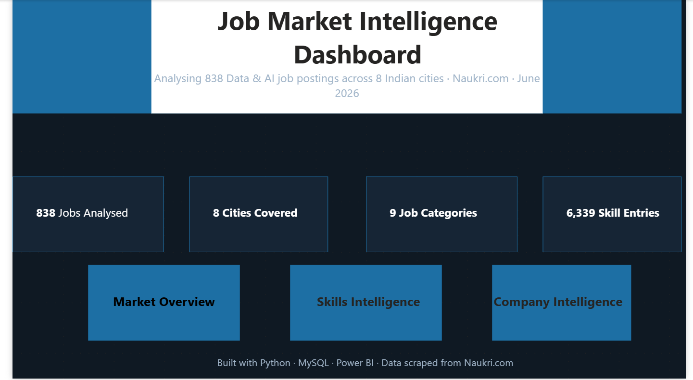
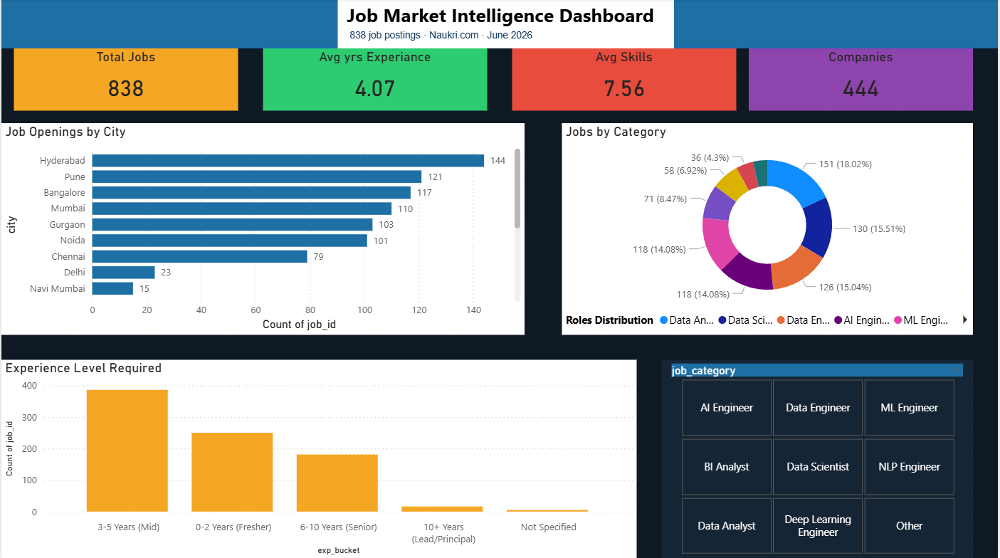
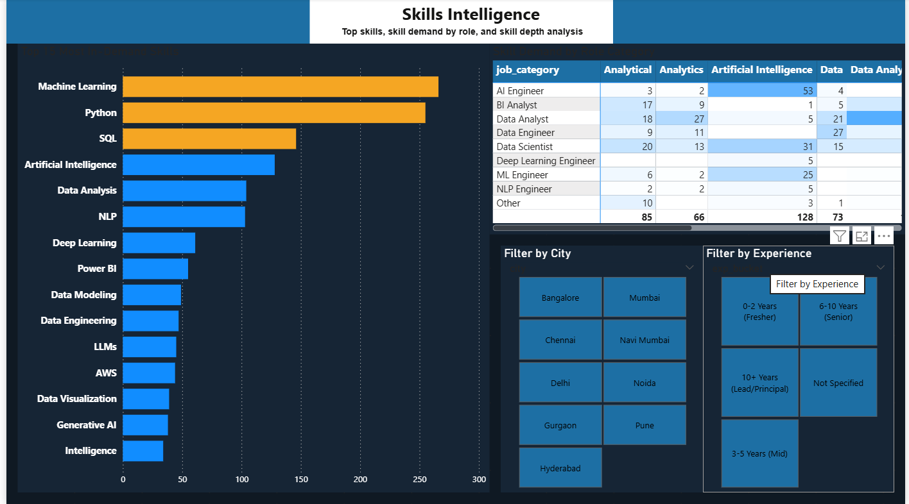
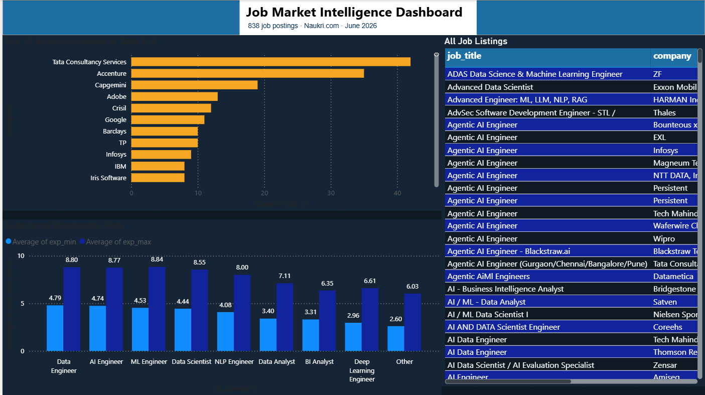

# 📊 Job Market Intelligence Dashboard

> An end-to-end data project — scraping, cleaning, SQL storage, EDA, Excel analysis, and a 4-page Power BI dashboard analysing **838 Data & AI job postings** across 8 Indian cities from Naukri.com.



---

## 🗂️ Project Overview

The Indian Data & AI job market is growing fast — but which skills are actually in demand? Which cities are hiring the most? What experience level do companies expect?

This project answers all of that by:
1. Scraping real job postings from Naukri.com using Python & Selenium
2. Cleaning and structuring the data with Pandas
3. Loading it into MySQL for SQL-based analysis
4. Performing EDA with Python (Matplotlib & Seaborn)
5. Building pivot table analysis in Excel
6. Building an interactive 4-page Power BI dashboard

---

## 📸 Dashboard Pages

### 🏠 Home Page


### 📈 Market Overview


### 🧠 Skills Intelligence


### 🏢 Company Intelligence


---

## 🔍 Key Findings

| Insight | Finding |
|--------|---------|
| 🥇 Most in-demand skill | Machine Learning (301 jobs) |
| 🐍 Top programming language | Python (275 jobs) |
| 🗃️ Top database skill | SQL (150 jobs) |
| 🏙️ Top hiring city | Hyderabad (144 jobs) |
| 🏢 Top hiring company | Tata Consultancy Services (42 jobs) |
| 📅 Most common experience | 3–5 Years (386 jobs) |
| 🔢 Avg skills per job posting | 7.6 skills |
| 💼 Most in-demand role | Data Analyst (151 jobs) |

---

## 🛠️ Tech Stack

| Layer | Tools Used |
|-------|-----------|
| Scraping | Python, Selenium, BeautifulSoup |
| Cleaning | Python, Pandas, NumPy |
| Storage | MySQL |
| EDA | Python, Matplotlib, Seaborn |
| Excel Analysis | Microsoft Excel (Pivot Tables, Charts) |
| Dashboard | Microsoft Power BI |
| Version Control | Git, GitHub |

---

## 📁 Project Structure

```
job-market-dashboard/
│
├── naukri_scraper.py          # Selenium scraper — collects job postings from Naukri.com
├── cleaning_pipeline.py       # Pandas cleaning — normalises cities, skills, experience
├── schema.sql                 # MySQL schema — creates jobs and job_skills tables
├── load_to_mysql.py           # Loads cleaned CSV into MySQL database
├── eda_analysis.py            # EDA — generates 8 charts and key insights
├── job_market_analysis.xlsx   # Excel analysis — 5 sheets with pivot tables and charts
│
├── eda_charts/                # 8 PNG charts generated by EDA script
├── eda_insights.txt           # Auto-generated key findings summary
│
├── Home.png                   # Dashboard screenshot — Home page
├── Overview.png               # Dashboard screenshot — Market Overview
├── Skills.png                 # Dashboard screenshot — Skills Intelligence
├── Companies.png              # Dashboard screenshot — Company Intelligence
│
└── README.md
```

---

## 📊 Excel Analysis (job_market_analysis.xlsx)

The Excel file contains 5 sheets:

| Sheet | Contents |
|-------|----------|
| naukri_jobs_cleaned | Full cleaned dataset — 838 rows, 14 columns |
| Jobs by City | Pivot table + bar chart — job count per city |
| Skills by Category | Pivot table + column chart — avg skills required per role |
| Experience Analysis | Pivot table + grouped chart — min vs max experience by role |
| Executive Summary | Formatted business summary for non-technical stakeholders |

---

## ⚙️ How to Run

### Step 1 — Install dependencies
```bash
pip install selenium webdriver-manager beautifulsoup4 pandas numpy matplotlib seaborn mysql-connector-python
```

### Step 2 — Scrape job data
```bash
python naukri_scraper.py
```
Collects 800+ job postings and saves to `naukri_jobs_raw.csv`

### Step 3 — Clean the data
```bash
python cleaning_pipeline.py
```
Outputs `naukri_jobs_cleaned.csv` with 14 structured columns

### Step 4 — Set up MySQL
- Open MySQL Workbench
- Run `schema.sql` to create the database and tables
- Update your password in `load_to_mysql.py`

```bash
python load_to_mysql.py
```

### Step 5 — Run EDA
```bash
python eda_analysis.py
```
Generates 8 charts in `/eda_charts/` and prints key insights

### Step 6 — Excel Analysis
- Open `job_market_analysis.xlsx`
- Navigate through 5 sheets for pivot table analysis and executive summary

### Step 7 — Power BI Dashboard
- Open Power BI Desktop
- Import `naukri_jobs_cleaned.csv`
- Create relationship between `jobs` and `job_skills` tables on `job_id`
- Build visuals across 4 pages

---

## 📊 Dashboard Features

### Page 1 — Home
- Project title and description
- 4 KPI stat boxes (838 jobs, 8 cities, 9 categories, 6,339 skill entries)
- Navigation buttons to all 3 analysis pages

### Page 2 — Market Overview
- 4 KPI cards (Total Jobs, Avg Experience, Avg Skills, Companies)
- Job openings by city (bar chart)
- Roles distribution (donut chart)
- Experience level required (column chart)
- Job category slicer (interactive filter)

### Page 3 — Skills Intelligence
- Top 15 most in-demand skills (bar chart with colour coding)
- Skill demand by role category (matrix heatmap)
- Filter by City slicer
- Filter by Experience slicer

### Page 4 — Company Intelligence
- Top 15 hiring companies (bar chart)
- Average experience required by role (column chart)
- Full job listings table (searchable, filterable)

---

## 📌 Data Details

| Field | Details |
|-------|---------|
| Source | Naukri.com |
| Scraped | June 2026 |
| Total rows | 838 unique job postings |
| Cities covered | Bangalore, Hyderabad, Pune, Mumbai, Delhi, Noida, Gurgaon, Chennai |
| Job roles | Data Scientist, Data Analyst, Data Engineer, ML Engineer, AI Engineer, BI Analyst, NLP Engineer, Deep Learning Engineer |
| Skill entries | 6,339 rows in normalised job_skills table |

---

## 👤 About

**Abhijith M Vijayan**
BSc Statistics | Data Science & AI Trainee at Luminar Technolab, Kochi

[](https://linkedin.com/in/abhijith-m-vijayan-767983362)
[](https://github.com/abhijith-mvijayan)

---

## ⭐ If you found this project useful, give it a star!
